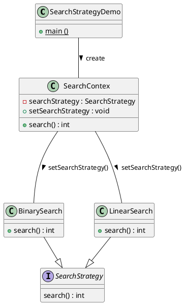
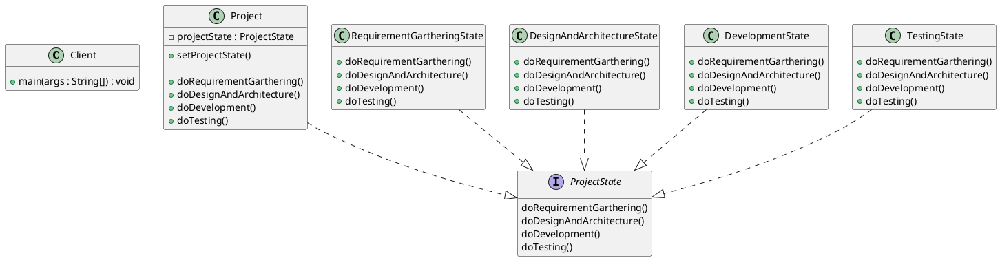

# Search demo

```plantuml
@startuml

SearchStrategyDemo -- SearchContex : create >
SearchContex --- BinarySearch : setSearchStrategy() >
SearchContex --- LinearSearch : setSearchStrategy() >
BinarySearch --|> SearchStrategy
LinearSearch --|> SearchStrategy

interface SearchStrategy {
    search() : int
}

class BinarySearch{
    + search() : int
}

class LinearSearch {
    + search() : int

}
class SearchContex {
  - searchStrategy : SearchStrategy
  + setSearchStrategy : void
  + search() : int
}

class SearchStrategyDemo {
    + {static} main ()
}
@enduml
```

# Project demo

```plantuml
@startuml
class Client {
    + main(args : String[]) : void
}
interface ProjectState{
  doRequirementGarthering()
  doDesignAndArchitecture()
  doDevelopment()
  doTesting()
}
Project ..|> ProjectState
RequirementGartheringState ..|> ProjectState
DesignAndArchitectureState ..|> ProjectState
DevelopmentState ..|> ProjectState
TestingState ..|> ProjectState

class Project  {
  - projectState : ProjectState

  + setProjectState()

  + doRequirementGarthering()
  + doDesignAndArchitecture()
  + doDevelopment()
  + doTesting()
}

class RequirementGartheringState {
  + doRequirementGarthering()
  + doDesignAndArchitecture()
  + doDevelopment()
  + doTesting()
}

class DesignAndArchitectureState {
  + doRequirementGarthering()
  + doDesignAndArchitecture()
  + doDevelopment()
  + doTesting()
}
class DevelopmentState {
  + doRequirementGarthering()
  + doDesignAndArchitecture()
  + doDevelopment()
  + doTesting()
}
class TestingState {
  + doRequirementGarthering()
  + doDesignAndArchitecture()
  + doDevelopment()
  + doTesting()
}

@enduml
```